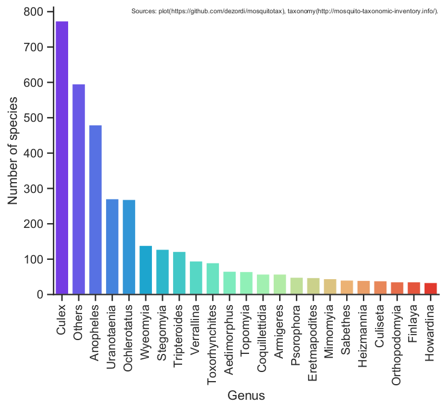

# Mosquito tax

This repository stores taxonomy information about mosquitoes. The source used to construct the tables and plots comes from [Mosquito Taxonomic Inventory (MTI)](http://mosquito-taxonomic-inventory.info/valid-species-list). Here we have three tsv files, the mos_tax.tsv that was built from [this pdf file](http://mosquito-taxonomic-inventory.info/sites/mosquito-taxonomic-inventory.info/files/Valid%20Species%20List_78.pdf), the aedes_tax.tsv file was built from [this other pdf file](http://mosquito-taxonomic-inventory.info/sites/mosquito-taxonomic-inventory.info/files/Valid%20Species%20%28composite%20Aedes%29_9.pdf) which according to MTI represents "A second pdf lists the aedine species that are classified for convenience as members of a very large composite genus Aedes by [Wilkerson et al. (2015)](http://mosquito-taxonomic-inventory.info/node/12733).", and the third file mos_mixed_tax.tsv represents a fusion between the two aforementioned tsv files, basically, I replace the entries of mos_tax.tsv correspondents to mosquitoes of Aedes genus defined by Wikerson et al 2015. Be careful with which taxonomy standard you will use (see plots in Usage section).

## Dependencies

This script was build on python 3.6.5+ and have these dependencies:

- [pandas](https://pandas.pydata.org/);
- [numpy](https://numpy.org/);
- [argparse](https://docs.python.org/3/library/argparse.html);
- [seaborn](https://seaborn.pydata.org/);
- [matplotlib](https://matplotlib.org/);

## Recomended lectures
- [Mosquito Taxonomic Inventory ](http://mosquito-taxonomic-inventory.info/valid-species-list): To understand the criteria involved in this taxonomy structure.
- [Recomende literature about mosquito taxonomy ](http://mosquito-taxonomic-inventory.info/biblio): To keep up to date with this field.
- [Color palletes of seaborn ](https://medium.com/@morganjonesartist/color-guide-to-seaborn-palettes-da849406d44f): To pass with -cm argument.

## Usage

- To plot the number of species by genus in a bar plot.
> python plots.py -in mos_tax.tsv

- To plot the number of species by genus in a bar plot.
> python plots.py -in mos_mixed_tax.tsv

- To plot the number of species in specific genus in a donut plot.
> python plots.py -in mos_tax.tsv -st Anopheles Culex Aedes -pt Donut -gb 1

- To plot the number of species in specific genus in a donut plot.
> python plots.py -in mos_mixed_tax.tsv -st Anopheles Culex Aedes -pt Donut -gb 1

- To get a help about the plots.py usage:
> python plots.py --help

## Interesting links about mosquitoes biology:
- [BOLDSYSTEMS ](https://www.boldsystems.org/index.php/Public_BINSearch?searchtype=records): To get barcode information;
- [VectorBase ](https://www.vectorbase.org/): To get genomes, transcriptomes, proteomes and other molecular information about mosquito and other vectors;
- [TIMETREE](http://www.timetree.org/): Put Culicidae in BUILD A TIME TREE Group to get the evolutionary tree with many information about geological scale and atmosphere levels, or just [Click here](https://itol.embl.de/tree/45462207268791593800428#) to see a cladogram of mosquitoes.

## Some considerations
If you use one of these plots, or the tsv table for some pourpose, please put the correct source: plot(https://github.com/dezordi/mosquitotax), taxonomy(http://mosquito-taxonomic-inventory.info/).

All data used in these plots are recovered from [MTI](http://mosquito-taxonomic-inventory.info/sites/mosquito-taxonomic-inventory.info/files/Valid%20Species%20List_77.pdf).

## Disclaimer

- I'm not a computer engineer or some related professional, I'm just write this script to study python and to automatize some bioinformatics tasks. So fell free to commit changes that makes the code more efficient or more clean.
- This script will continue to be developed to englobe others functions, like create histograms with years of mosquito collection.
